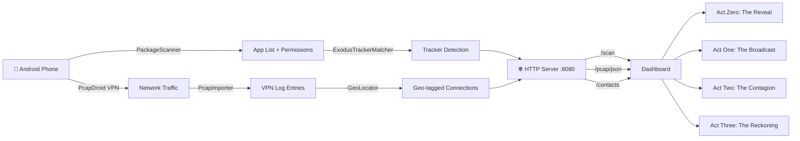

<p align="center">
  
  
  
  
  
</p>

# 🎭 Consent Theater

> **See what your phone *really* does behind the curtain.**

Consent Theater is a privacy awareness tool that scans your Android phone's installed apps, detects embedded trackers, captures live network traffic, and presents the findings as an interactive, theatrical 4-act data story — revealing exactly who is watching, what they know, and how much your data is worth.

---

## 🎬 The Four Acts

| Act | Title | What It Shows |
|---|---|---|
| **Act Zero** | *The Reveal* | Installed apps grid with risk scores, tracker treemap by company, permission matrix, demographic profiling & data valuation |
| **Act One** | *The Broadcast* | 3D globe showing real-time tracker connections, 24-hour timeline, worst offender scoreboard |
| **Act Two** | *The Contagion* | Force-directed graph showing data flow between apps/contacts, ghost contact detection, trust scores |
| **Act Three** | *The Reckoning* | App privacy grades, GDPR deletion request generator, tracker blocking simulation, data receipt mockup |

---

## 🏗️ Architecture

```
consent-theater/
├── dashboard/          # React + Vite + TypeScript (Web UI)
│   ├── src/
│   │   ├── components/
│   │   │   ├── ActZero/    # AppGrid, TrackerTreemap, PermissionMatrix, PredictionPanel
│   │   │   ├── ActOne/     # ConnectionGlobe, Timeline, Scoreboard, WorstOffenders
│   │   │   ├── ActTwo/     # ContagionGraph, GhostContacts, TrustScore, DrillDown, IndictmentPanel
│   │   │   ├── ActThree/   # AppGrades, BlockingPanel, DeletionPanel, ReceiptMockup
│   │   │   └── shared/     # Navigation, DataUploader, AnimatedCounter
│   │   ├── hooks/          # useAppData (data fetching & normalization)
│   │   ├── utils/          # Inference engine, revenue calculator, PDF export
│   │   └── types/          # TypeScript interfaces matching TDD schema
│   └── ...
├── scanner/            # Flutter (Android Phone Scanner)
│   └── lib/
│       ├── scanner/        # PackageScanner, ExodusTrackerMatcher, PermissionAnalyzer
│       │                    # PcapImporter, GeoLocator
│       ├── export/         # TransferServer (HTTP), DataExporter (JSON/file)
│       └── ui/             # ScanScreen
└── data/               # Sample datasets for demo mode
    ├── sample-scan.json
    ├── sample-vpn-log.json
    ├── mock-contacts.json
    ├── broker-contacts.json
    └── tracker-company-db.json
```

---

## 🚀 Quick Start

### Dashboard (Web)

```bash
cd dashboard
npm install
npm run dev
# Opens at http://localhost:5173
```

### Scanner (Android)

```bash
cd scanner
flutter pub get
flutter build apk --debug
# Install build/app/outputs/flutter-apk/app-debug.apk on your phone
```

### Connect Phone → Dashboard

1. Install the Scanner APK on your Android phone
2. Run a scan — the app starts an HTTP server on port `8080`
3. On the dashboard, enter the phone's IP: `http://<phone-ip>:8080`
4. Data loads automatically across all four acts

---

## 📱 Scanner Endpoints

The Flutter scanner runs a local HTTP server exposing:

| Endpoint | Method | Description |
|---|---|---|
| `/scan` | GET | Full scan results (apps + trackers + risk scores) |
| `/scan/raw` | GET | Quick raw app list |
| `/contacts` | GET | Device contact list |
| `/pcap/json` | GET | Processed VPN log as JSON (for globe/timeline) |
| `/pcap` | GET | Raw PCAP binary file |
| `/export` | GET | Full scan data + save to file |

---

## 🔧 Tech Stack

### Dashboard
- **React 19** + **TypeScript 5.9** — Component architecture
- **Vite 7** — Build tooling
- **Tailwind CSS 3** — Styling with custom theater theme
- **Recharts** — TrackerTreemap, data visualizations
- **Globe.gl** + **Three.js** — 3D WebGL globe for Act One
- **D3.js** + **react-force-graph-2d** — Force-directed contagion graph
- **Framer Motion** — Smooth animations and transitions
- **jsPDF** — GDPR deletion letter PDF generation
- **Lucide React** — Icon library

### Scanner
- **Flutter 3.8** + **Dart** — Cross-platform mobile
- **Dio** — HTTP client for Exodus Privacy API
- **Hive** — Local caching of tracker database
- **CSV** — PcapDroid log parsing
- **QR Flutter** — QR code for easy dashboard connection

---

## 📊 Data Flow



---

## 🎨 Features

### Act Zero — The Reveal
- **App Grid** — Every installed app with risk score badge (0–100), tracker count, dangerous permission count
- **Tracker Treemap** — Company-colored rectangles sized by tracker prevalence across all apps
- **Permission Matrix** — Heatmap showing which apps access which dangerous permissions
- **Prediction Panel** — AI-inferred demographic profile + estimated annual data revenue in INR

### Act One — The Broadcast
- **3D Connection Globe** — Animated WebGL globe showing tracker connections from your phone to servers worldwide, with 24-hour playback
- **24-Hour Timeline** — Bar chart showing data sent per hour, highlighting activity while you sleep
- **Scoreboard** — Real-time stats (connections, companies, countries)
- **Worst Offenders** — Top apps by tracker connection volume

### Act Two — The Contagion
- **Contagion Graph** — Force-directed network showing how your data spreads between apps, trackers, and contacts
- **Ghost Contacts** — People in your contact list exposed to trackers without their knowledge
- **Trust Score** — Overall privacy health score
- **Drill Down** — Detailed per-app data flow breakdown

### Act Three — The Reckoning
- **App Grades** — A/B/C/D/F privacy grades for every app
- **Blocking Simulation** — "What if" panel showing connection reduction by blocking tracker categories
- **GDPR Deletion Panel** — Generate GDPR/DPDP data deletion request PDFs for each tracker company
- **Data Receipt** — Mockup receipt showing the "price" of your data

---

## 🔒 Privacy & Ethics

- **All processing is local** — No data leaves your phone or browser
- **No cloud servers** — The scanner's HTTP server runs on localhost/LAN only
- **No data collection** — We don't store, transmit, or sell any scan data
- **Open source** — Full transparency in what we scan and how we score
- **Educational purpose** — Designed to raise awareness, not to shame users

---

## 🧑‍🤝‍🧑 Team

Built for the hackathon by the Consent Theater team.

---

## 📝 License

MIT License — See [LICENSE](LICENSE) for details.
